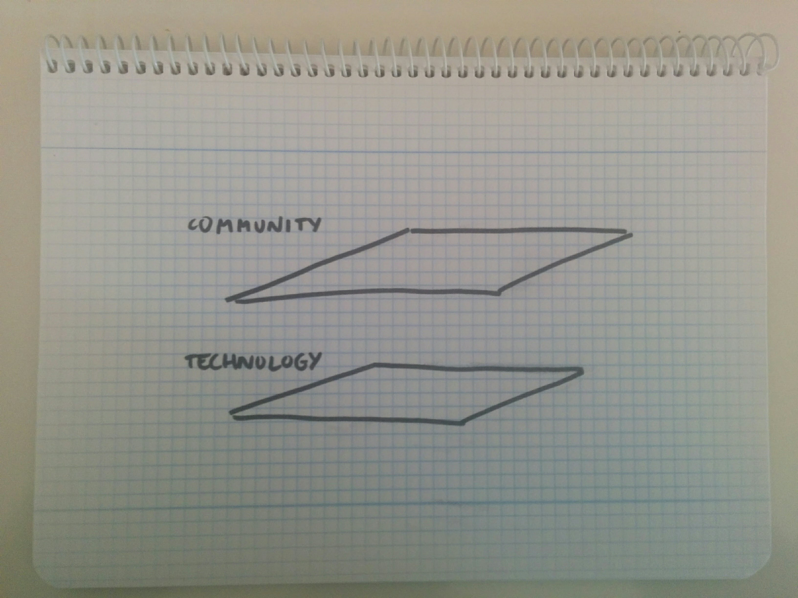
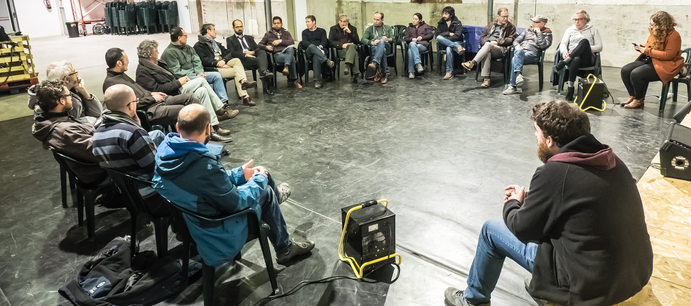
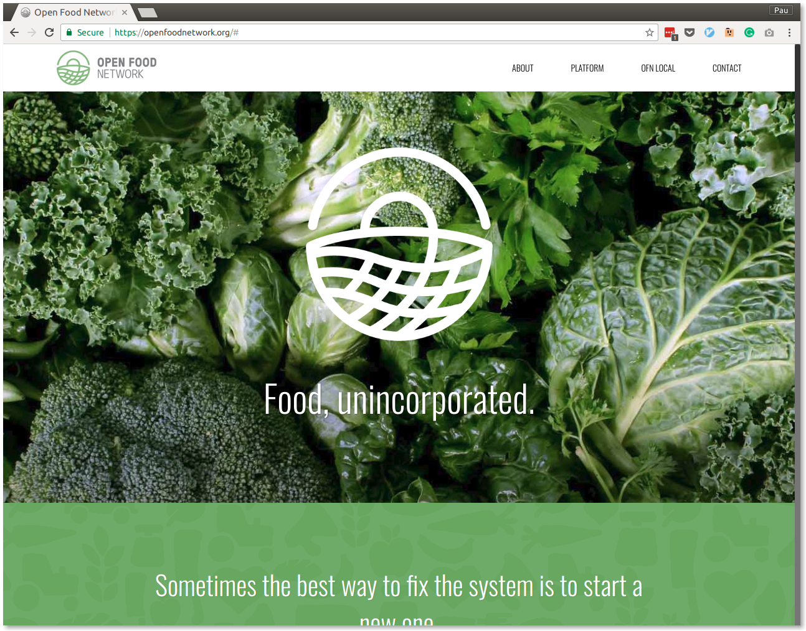

# Platform coop: The Katuma case

---

## Goals

[.footer: Photo by Todd Diemer on Unsplash]

---

### Goals

Help small-scale producers and responsible food consumption survive

---

### Network

* Small producers
* Group consumption
* Better logistics

---

## Layers

---

## Community

[.footer: Photo by Salvador Atance]

---

### Sectors

* Production
* Consumption

---

### Threats

* Fragmentation: lack of coordination in both sectors
* Complex project, hard to communicate

---

## Technology

[.footer: Photo by Johannes Plenio on Unsplash]

---

## Technology

Platform to place and manage orders from food hubs to producers **across a network**

---

### Open Food Network

---

### Threats

* Two-level governance: local and global
* Scarcity of resources
* Funding open source

---

## Model

[.footer: Photo by rawpixel.com on Unsplash]

---

## Model

Platform cooperativism

* Resonate, streaming music service
* Mytaxi UK / Black Cab coop, taxi service
* Fairmondo, online marketplace

---

## Model

Sustainability

---

---

### Drives the Katuma platform

---

### Katuma it's just one of the projects

OpenFoodNetwork, TimeOverflow, OdooCoop, etc.

---

## Dig deeper

* https://katuma.org
* https://github.com/hng/tech-coops
* https://github.com/mwmeyer/awesome-tech-cooperatives
* https://platform.coop/
* https://resonate.is/
* https://www.thenews.coop/122467/sector/community/taxiapp-londons-black-cab-co-op-alternative-uber/
* https://fairmondo.uk/

[.footer: Photo by Matteo Paganelli on Unsplash]

---

## Q&A

