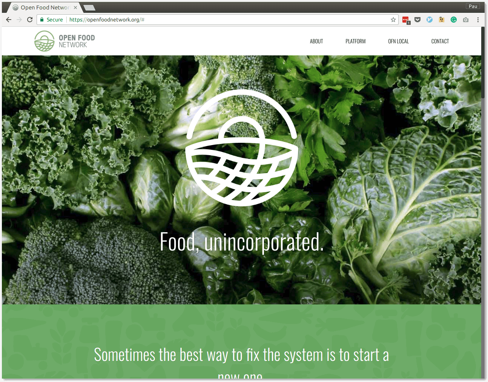

# Platform coop: The Katuma case

---

## Goals

---

Help small-scale producers and responsible food consumption survive

---

### Network

* Small producers
* Group consumption
* Better logistics

---

## Layers

---

## Community

---

### Sectors

* Production
* Consumption

---

### Threats

* Fragmentation: lack of coordination in both sectors
* Complex project, hard to communicate

---

## Technology

Platform to place and manage orders from food hubs to producers **across a network**

---

### Open Food Network

---

### Threats

* Two-level governance: local and global
* Scarcity of resources

---

## Model

Platform cooperativism

---

## Model

Sustainability

---

# Coopdevs

---

### Drives the platform

---

### Katuma it's just one of the projects

OpenFoodNetwork, TimeOverflow, OdooCoop, etc.

---

## Dig deeper

* https://resonate.is/
* https://github.com/hng/tech-coops
* https://github.com/mwmeyer/awesome-tech-cooperatives
* https://platform.coop/

---

## Q&A
